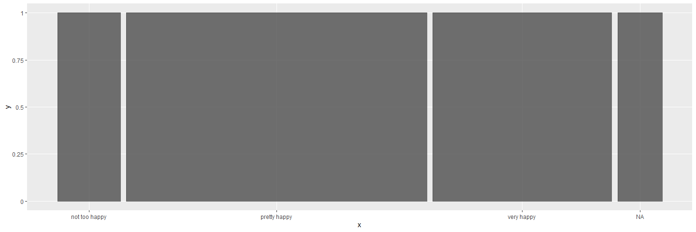
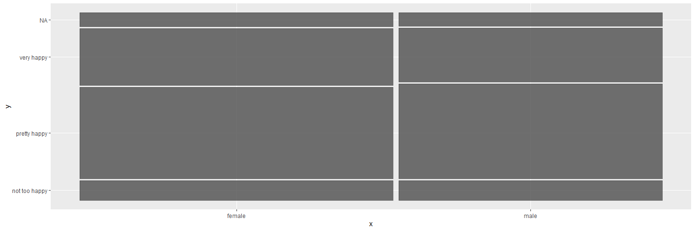
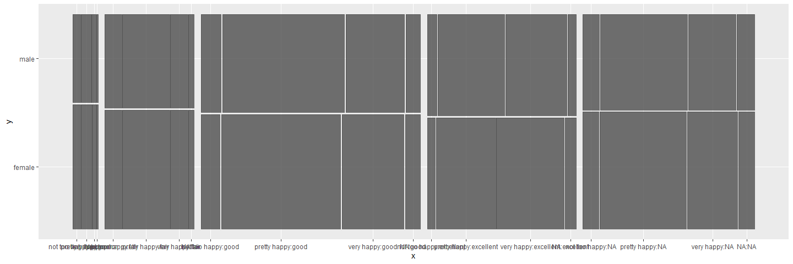
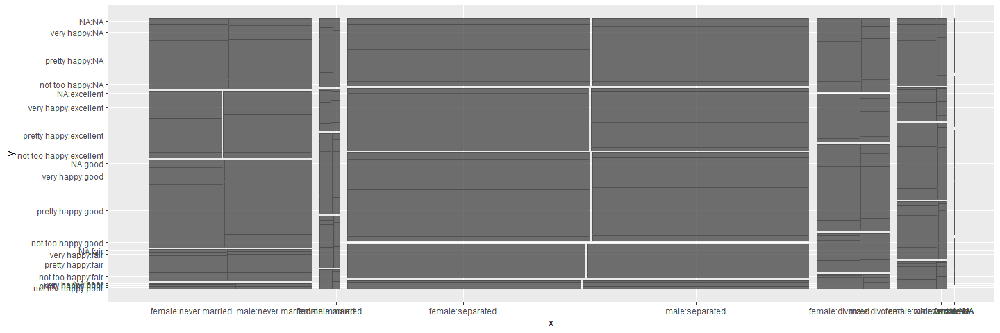
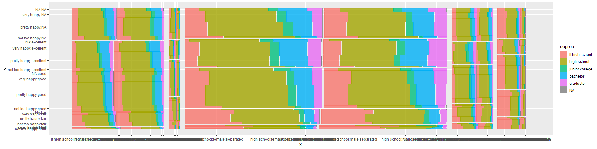
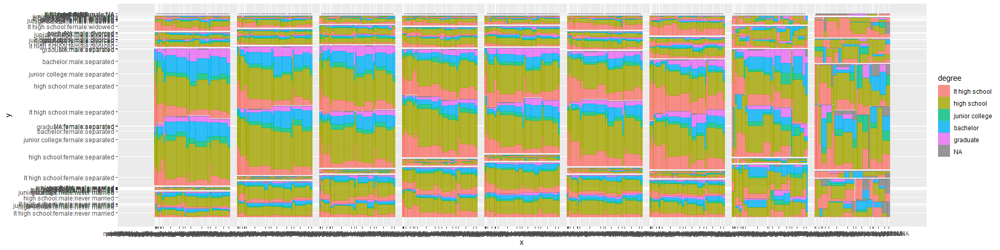
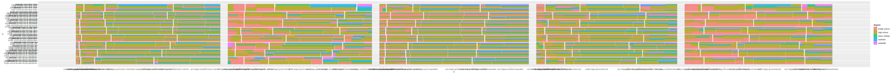

ggmosaic
================

\`\`

``` r
library(ggmosaic)
```

    ## Loading required package: ggplot2

## ggmosaic::geom\_mosaic

#### 1\. Arguments

geom\_mosaic(mapping = NULL, data = NULL, stat = “mosaic”, position =
“identity”, na.rm = FALSE, divider = mosaic(), conds=NULL, offset =
0.01, show.legend = NA, inherit.aes = FALSE, …)

1)  mapping: aes(weight, x, y, fill) weight: Frequency, relative
    frequency, … \#must be numeric which means the area of each mosaic
    x: x=product(col\_1, col\_2, col\_3,…) y: no y value fill:col, used
    to split rectangle and color it, no fill no color conds:
    conds=product(col) \#condition

either x and fill can split the graph (b) data: must be data.frame, can
not use table (c) divider: vspine, hspine

#### 2\. Split direction

1)  \~happy

<!-- end list -->

``` r
ggplot(data = happy) +
  geom_mosaic(aes(weight = wtssall, x = product(happy)))
```

<!-- -->

2)  \~happy+sex

<!-- end list -->

``` r
ggplot(data = happy) +
  geom_mosaic(aes(weight = wtssall, x = product(happy, sex)))
```

<!-- -->

3)  \~sex+happy|health

<!-- end list -->

``` r
ggplot(data = happy) +
  geom_mosaic(aes(weight = wtssall, x = product(happy, sex, health)))
```

<!-- -->

4)  \~happy|health + sex|marital \#product\_col\_1|product\_col\_3,
    product\_col\_2|product\_col\_4

<!-- end list -->

``` r
ggplot(data = happy) +
  geom_mosaic(aes(weight = wtssall, x = product(happy, sex, health, marital)))
```

<!-- -->

5)  \~happy|health + degree|sex|marital

<!-- end list -->

``` r
ggplot(data = happy) +
  geom_mosaic(aes(weight = wtssall, x = product(happy, sex, health, marital), fill=degree))
```

<!-- -->

6)  \~happy|health + degree|sex|marital

<!-- end list -->

``` r
ggplot(data = happy) +
  geom_mosaic(aes(weight = wtssall, x = product(happy, sex, health, marital), fill=degree, conds=product(partyid)))
```

<!-- -->

7)  \~degree|sex|partyid+happy|health|marital

<!-- end list -->

``` r
ggplot(data = happy) +
  geom_mosaic(aes(weight = wtssall, x = product(happy, sex, health), fill=degree, conds=product(partyid, marital)), na.rm=TRUE)
```

<!-- -->

In conclusion, the direction of splitting is based on the number of
columns used on the function and the order of these columns. When the
number of “x” columns is odd: 1) the “x” columns will be added to
x-axis, y-axis, x-axis, …, respectively; 2) the “fill” column will be
added to the front of y-axis; 3) and the “conds” columns will be added
to the end of y-axis or x-axis, which depends on the number of “conds”
columns. When the number of “conds” columns is odd, the order of adding
to the end of axis is x-axis, y-axis, x-axis, …; when the number is
even, the order is y-axis, x-axis, y-axis, x-axis, …

When the number of “x” columns is even: 1) the “x” columns will be added
to y-axis, x-axis, y-axis, …, respectively; 2) the “fill” column will be
added to the front of x-axis; 3) and the order of “conds” columns is
oposite to the following situation, it will become y-axis, x-axis,
y-axis,…, when the number of “conds” columns is odd; or x-axis, y-axis,
x-axis, y-axis,…, when the number of “conds” columns is even.

The directions of these columns all depend on the rule that making sure
the number of columns on x-axis will greater than or equal to the number
on y-axis (|X|=|Y| or |X|=|Y|+1). And the first step for splitting is
ordering the direction of “x” columns, and then “fill” columns, and
finally “conds” columns. Besides, no matter which arguments’ direction
need to be determined, the most important thing is obeying the rule.
