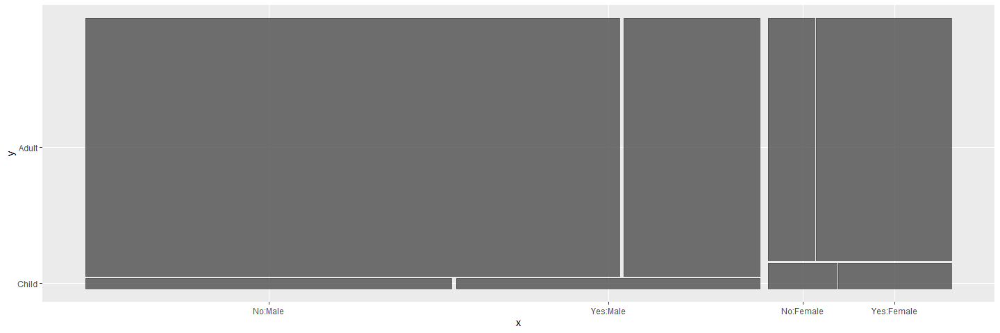
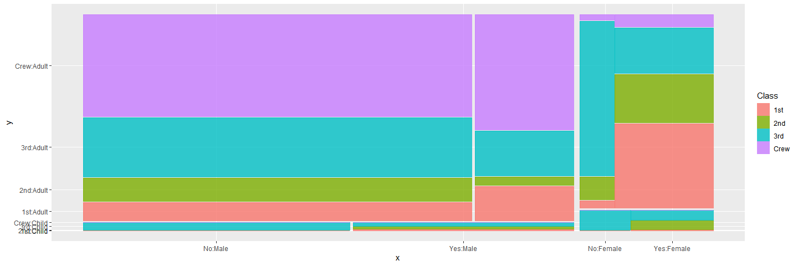
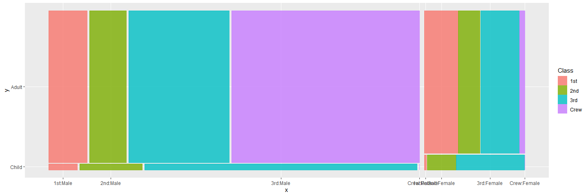
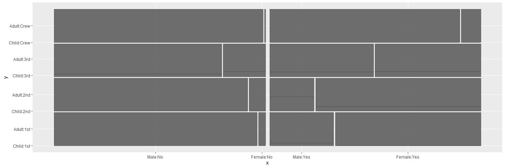
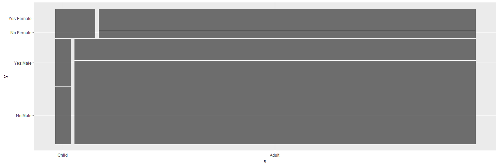
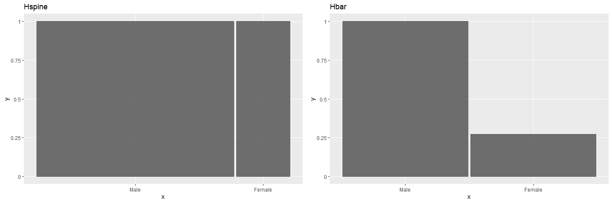
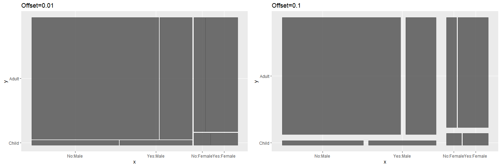
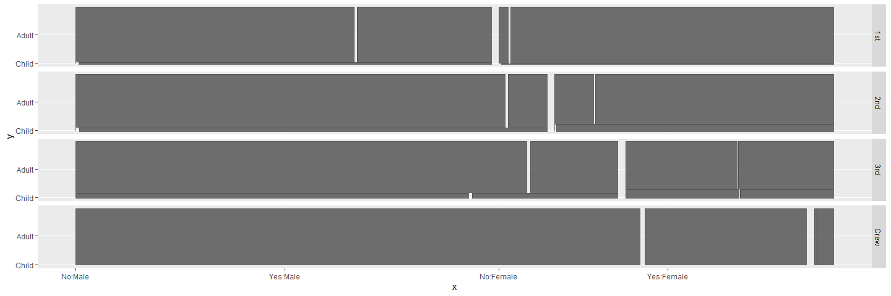

# edav_comparative_mosaic
Community Contribution - comparative study of vcd::mosaic and geom_mosaic

    library(ggmosaic)

    ## Loading required package: ggplot2

    library(gridExtra)
    Titanic<-as.data.frame(Titanic)

geom\_mosaic:

gwom\_mosaic is similar to mosaic, which is designed to display the
relationship between categorical variables.

The basic parameters of geom\_mosaic is

    geom_mosaic(mapping = NULL, data = NULL, stat = "mosaic", position = "identity", conds=NULL, na.rm = FALSE, divider = mosaic(), offset = 0.01, show.legend = NA, inherit.aes = FALSE, ...)

The following is the description of parameters:

1.  mapping: in geom\_mosaic, this is used to specify categorical
    varaibles and numeric variable to be displayed. The basic parameters
    of mapping is

<!-- -->

    aes(weight=NULL, x=NULL, fill=NULL)

weight: select a weighting variable, it can be frequency, relative
frequency or other similar weighting variables, but it must be numeric.
In mosaic graph, this parameter is used to show the area of each
splitting rectangle.

x: select variables to add to formula, which is used to assign
categorical varaibles. The basic parameters of x is

    x=product(col_1, col_2, col_3,...)

For example,

    ggplot(data = Titanic) +
      geom_mosaic(aes(weight = Freq, x = product(Survived, Age, Sex)))

 The
data is partinioned by Sex first, then Age, and finally Survived.

fill: select a variable to be filled, it is used to color each rectangle
in different colors, which is same to splitting each rectangle into two
smaller rectangle and then coloring each smaller rectangle in the same
parent rectangle in different colors. For example,

    ggplot(data = Titanic) +
      geom_mosaic(aes(weight = Freq, x = product(Survived, Age, Sex), fill=Class))

 In
this example, the order of partition is Sex, Age, Survived, and then
each rectangle splitted by Sex, Age and Survived will aldo be
partitioned by Class into 4 smaller rectanglers and then color these
smaller ones into four different colors. The most important thing for
this parameter is that the direction of splitting depends on the number
of patameters in x. In the above example, the number of patameters in x
is 3, which is odd, then the data is partitioned by Class horizontally.
While when the number of patameters in x is even, for example, it is 2,

    ggplot(data = Titanic) +
      geom_mosaic(aes(weight = Freq, x = product(Age, Sex), fill=Class))

 we
can see the direction is now vertical.

conds: select variables to condition on, which will be used first for
splitting. The basic parameters of conds is

    conds=product(col_1, col_2, ...)

For example,

    ggplot(data = Titanic) +
      geom_mosaic(aes(weight = Freq, x = product(Age, Sex), conds=product(Class, Survived)))

 In
this example, the data is partitioned by variables in conds first,
(Survived, then Class), and then by variables in x.

When variables in “product”, then the order is always from the right
most varible to the left most variable, not only in x but also in conds.

And geom\_mosaic is a little different to other geom\_\* functions, we
don’t need to and also can’t specific y. In geom\_mosaic, there is no y
value.

1.  data: only data frame can be used, no “table” or “ftable”. If we
    want to use an object of “table”, we must transfer it into
    dataframe.

<!-- -->

    Titanic <- as.data.frame(Titanic)

And we can also put data in the function of ggplot.

(3)na.rm: the default is “FALSE”, which means it will not remove “NA”;
while when it equals to “TURE”, it will remove missing values.

1.  divider: we have two methods to set divider. The first one is
    mosaic().The default of directions is first vertical and then
    horizontal, repeatedly. And we can also use divider to reset the
    directions of splitting. For example,

<!-- -->

    ggplot(data = Titanic) +
      geom_mosaic(aes(weight = Freq, x = product(Survived, Age, Sex)), divider = mosaic("v"))

 The
default parameter is “horizontal”(or “h”), the splitting directions is
v-h-v-h-…; while when using “vertical”(or “v”), the directions will
become h-v-h-v-…. In other words, it is transversed, varaibles in y-axis
will be in x-axis, and varaibles in x-axis will be in y-axis.

The second one is setting divider directly, hspine, vspine, vbar or
hbar. But in this method, the data can only be splitted by one
categorical variable. Using hspine or vspine, it is same to the original
mosaic graph, which using vbar or hbar, it will be like bar chart. For
example,

    p1<-ggplot(data = Titanic) +
      geom_mosaic(aes(weight = Freq, x = product(Sex)), divider="hspine")+ggtitle("Hspine")
    p2<-ggplot(data = Titanic) +
      geom_mosaic(aes(weight = Freq, x = product(Sex)), divider="hbar")+ggtitle("Hbar")
    grid.arrange(p1, p2, nrow = 1)

(5)offset:set the space between the first spine, but at the same time,
the space between other spines also will change in equal proportion. For
example,

    g1<-ggplot(data = Titanic) +
      geom_mosaic(aes(weight = Freq, x = product(Survived, Age, Sex)),offset = 0.01)+ggtitle("Offset=0.01")
    g2<-ggplot(data = Titanic) +
      geom_mosaic(aes(weight = Freq, x = product(Survived, Age, Sex)),offset = 0.05)+ggtitle("Offset=0.1")
    grid.arrange(g1, g2, nrow = 1)

Besides, geom\_mosaic also has other similar features of ggplot, like it
can use facet\_\* to facet. For example,

    ggplot(data = Titanic) +
      geom_mosaic(aes(weight = Freq, x = product(Survived, Age, Sex)))+facet_grid(Class~.)

