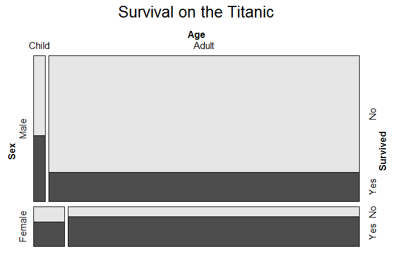
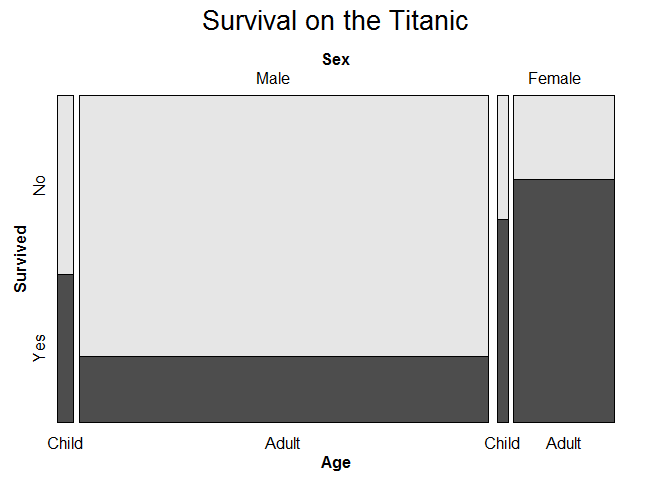
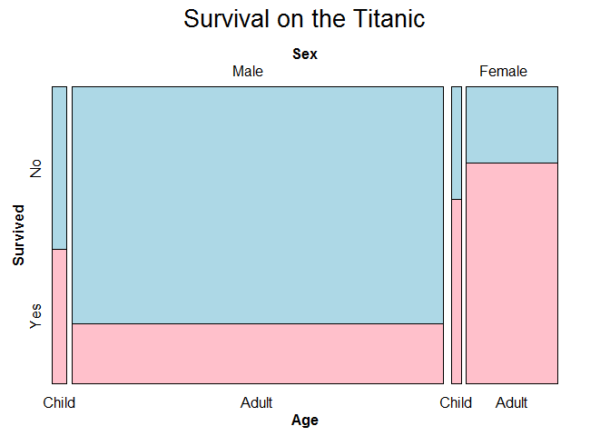
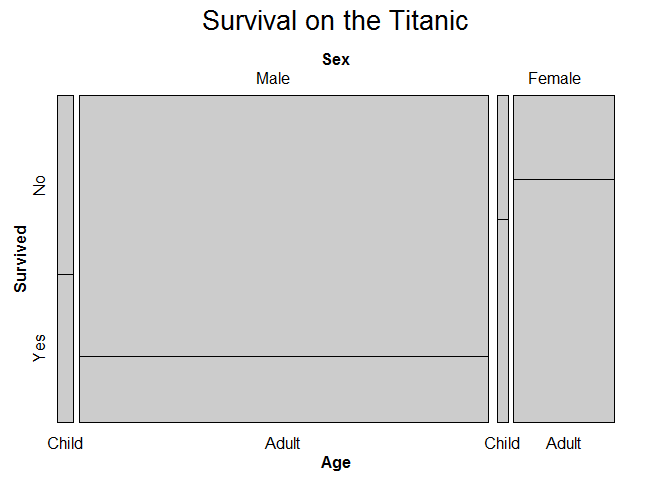

Comparative Study of vcd::mosaic and geom\_mosaic
================

## GitHub Documents

This is an R Markdown format used for publishing markdown documents to
GitHub. When you click the **Knit** button all R code chunks are run and
a markdown file (.md) suitable for publishing to GitHub is generated.

``` r
library(vcd)
```

    ## Loading required package: grid

A mosaic plot is a graphical display that allows you to examine the
relationship among two or more categorical variables. It is basically an
area-proportional visualization of (typically, observed) frequencies,
composed of tiles (corresponding to the cells) created by recursive
vertical and horizontal splits of a rectangle. Thus, the area of each
tile is proportional to the corresponding cell entry given the
dimensions of previous splits. The categorical variables are first put
in order. Then, each variable is assigned to an axis. In the table to
the right, sequence and classification is presented for this data set.
Another ordering will result in a different mosaic plot, i.e., the order
of the variables is significant as for all multivariate plots.

A classic example of mosaic plots uses data from the passengers on the
Titanic. The data used for this example has 2201 observations and 3
variables. The variables are:

The observations were compiled into the following table:

``` r
str(Titanic)
```

    ##  'table' num [1:4, 1:2, 1:2, 1:2] 0 0 35 0 0 0 17 0 118 154 ...
    ##  - attr(*, "dimnames")=List of 4
    ##   ..$ Class   : chr [1:4] "1st" "2nd" "3rd" "Crew"
    ##   ..$ Sex     : chr [1:2] "Male" "Female"
    ##   ..$ Age     : chr [1:2] "Child" "Adult"
    ##   ..$ Survived: chr [1:2] "No" "Yes"

There are several functions available to produce mosaic plot including
mosaicplot vcd::mosaic, ggmosaic

In the following sections, we are going to present a compatitive study
of vcd::mosaic and ggmosaic. Out goal is descirbe the ease of the
functions and some user friendly explainon of the paramters.

We will use Titanic data to plot different mosaic plots.

vcd::mosaic:

mosaic is one of the functions of strucplot framework which we can get
from importing vcd R package.The main idea of strucplot is to visualize
the tables’ cells arranged in rectangular form structable objects. The
“flattened” contingency table can be obtained using the structable()
function.

The basic parameters of mosaic is

mosaic(x, condvars = NULL, split\_vertical = NULL, direction = NULL,
spacing = NULL, spacing\_args = list(), gp = NULL, expected = NULL,
shade = NULL, highlighting = NULL, highlighting\_fill = grey.colors,
highlighting\_direction = NULL, zero\_size = 0.5, zero\_split = FALSE,
zero\_shade = NULL, zero\_gp = gpar(col = 0), panel = NULL, main = NULL,
sub = NULL, …)

OR

mosaic(formula, data, highlighting = NULL, …, main = NULL, sub = NULL,
subset = NULL, na.action = NULL)

The following is the description of parameters:

x  
a contingency table in array form, with optional category labels
specified in the dimnames(x) attribute, or an object of class
“structable”. x is a table or formula. structable can also be deduced
from data frame using formula. For example,

``` r
HEC <- structable(Eye ~ Sex + Hair, data = HairEyeColor)
HEC
```

    ##              Eye Brown Blue Hazel Green
    ## Sex    Hair                            
    ## Male   Black        32   11    10     3
    ##        Brown        53   50    25    15
    ##        Red          10   10     7     7
    ##        Blond         3   30     5     8
    ## Female Black        36    9     5     2
    ##        Brown        66   34    29    14
    ##        Red          16    7     7     7
    ##        Blond         4   64     5     8

formula a formula specifying the variables used to create a contingency
table from data. For convenience, conditioning formulas can be
specified; the conditioning variables will then be used first for
splitting. If any, a specified response variable will be highlighted in
the cells.

For example, If we want to split the plot by 1 varialbe, we can specify
as \~V1 If V2 is dependent on V1 and needs to be highlighted, we can do
V2 \~ V1

In the following example, a mosaic plot is crated from Titanic data:

``` r
mosaic(Survived ~ Sex + Age, data = Titanic,
main = "Survival on the Titanic")
```

<!-- -->

In the above plot, the data is partinioned by sex first and then age;
after that survival is used to show the dependency

``` r
mosaic(Survived ~ ., data = Titanic)
```

<!-- -->

This type of formuall is used when one variable is needed to be
highlighted based on rest of the varialbe. Survived is highlihgted based
on all otther dependend variables.

data  
either a data frame, or an object of class “table” or “ftable”.

If we provide, structable contingency table, we do not need to provide
data (df or table)

direction  
character vector of length k, where k is the number of margins of x
(values are recycled as needed). For each component, a value of “h”
indicates that the tile(s) of the corresponding dimension should be
split horizontally, whereas “v” indicates vertical split(s).

By default, vcd::mosaic() splits horizontally from left for the first
variable (e.g. \~ V1, \~ V1 + V2, \~ V2 | V1 or V2 \~ V1 – here V1 is
considered as first variable) and vertically from top for the second
variable and so on. If we want to alter this direction, we can provide
this “direction” parameter. For example,

``` r
 mosaic(Survived ~ Sex + Age, data = Titanic, main = "Survival on the Titanic",direction=c("v","v","h"))
```

<!-- -->

\# Sex = Vertical, Age = Vertical, Survived = Horizonal In the above
plot, the sex variable is used to split the plot vertically, then age
variable is used to sub-devide verticaly and then survived sub-division
is highlighted horizontally from other side.

gp  
object of class “gpar”, shading function or a corresponding generating
function (see details and shadings). Components of “gpar” objects are
recycled as needed along the last splitting dimension. Ignored if shade
= FALSE.

if gp is not provided, the default gray color is applied with shade =
TRUE

``` r
mosaic(Survived~ Sex + Age, data = Titanic,
       main = "Survival on the Titanic", shade = TRUE,
       direction=c("v","v","h"))
```

<!-- -->

if gp is provided with shade = TRUE (or no shade parameter but not shade
= FALSE), the provided color along with other graphical paramters (if
provided any) will apply.

``` r
mosaic(Survived~ Sex + Age, data = Titanic,
       main = "Survival on the Titanic", shade = TRUE,
       direction=c("v","v","h"), gp = gpar(fill=c('lightblue', 'pink'))
                 )
```

<!-- -->

shade  
logical specifying whether gp should be used or not (see gp). If TRUE
and expected is unspecified, a default model is fitted: if condvars (see
strucplot) is specified, a corresponding conditional independence model,
and else the total independence model.

If we provide shade = FALSe, the gp will not apply at all.

``` r
mosaic(Survived~ Sex + Age, data = Titanic,
       main = "Survival on the Titanic", shade = FALSE,
       direction=c("v","v","h"), gp = gpar(fill=c('lightblue', 'pink'))
                 )
```

    ## Warning in strucplot(x, condvars = if (is.null(condvars)) NULL else
    ## length(condvars), : gp parameter ignored since shade = FALSE

<!-- -->

Reference: 1)
<https://pdfs.semanticscholar.org/2416/2c1a46669f94356854176ece8548bf7fb989.pdf>
2)
<https://ncss-wpengine.netdna-ssl.com/wp-content/themes/ncss/pdf/Procedures/NCSS/Mosaic_Plots.pdf>
3) <https://en.wikipedia.org/wiki/Mosaic_plot> 4)
<http://www.pmean.com/definitions/mosaic.htm>
